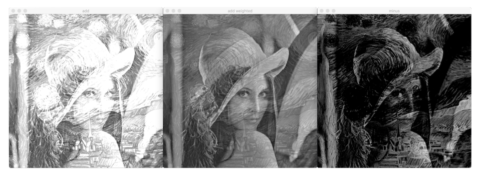

# 산술 연산

## 수식

**덧셈**


**가중치 범위**


**뺄셈**


**차이 연산**


### 함수

#### 덧셈

[add](https://docs.opencv.org/master/d2/de8/group__core__array.html#ga10ac1bfb180e2cfda1701d06c24fdbd6)

- mask: 8비트 1채널 마스크 영상. mask 행렬 원소 값이 0이 아닌 위치에서 덧셈 연산 수행
- dtype: 출력 행렬 깊이. 깊이가 같은 경우 -1

c++:

```cpp
void cv::add (InputArray src1, InputArray src2, OutputArray dst, InputArray mask = noArray(), int dtype = -1)
```

python:

```py
dst = cv.add(src1, src2[, dst[, mask[, dtype]]])
```

#### 가중치 덧셈

[addWeighted](https://docs.opencv.org/master/d2/de8/group__core__array.html#gafafb2513349db3bcff51f54ee5592a19)

c++:

```cpp
void cv::add (InputArray src1, double alpha, InputArray src2, double beta, double gamma, OutputArray dst, int dtype = -1)
```

python:

```py
dst = cv.add(src1, alpha, src2, beta, gamma[, dst[, dtype]])
```

#### 뺄셈

[subtract](https://docs.opencv.org/master/d2/de8/group__core__array.html#gaa0f00d98b4b5edeaeb7b8333b2de353b)

c++:

```cpp
void cv::subtract (InputArray src1, InputArray src2, OutputArray dst, InputArray mask = noArray(), int dtype = -1)
```

python:

```py
dst = cv.subtract(src1, alpha, src2, beta, gamma[, dst[, dtype]])
```

#### 차이 연산

[absdiff](https://docs.opencv.org/master/d2/de8/group__core__array.html#ga6fef31bc8c4071cbc114a758a2b79c14)

c++:

```cpp
void cv::absdiff (InputArray src1, InputArray src2, OutputArray dst)
```

python:

```py
dst = cv.absdiff(src1, src2[, dst])
```

#### 곱셈

[multiply](https://docs.opencv.org/master/d2/de8/group__core__array.html#ga979d898a58d7f61c53003e162e7ad89f)

c++:

```cpp
void cv::multiply (InputArray src1, InputArray src2, OutputArray dst, double scale = 1, int dtype = -1)
```

python:

```py
dst = cv.multiply(src1, src2[, dst[, scale[, dtype]]])
```

#### 나눗셈

[divide](https://docs.opencv.org/master/d2/de8/group__core__array.html#ga6db555d30115642fedae0cda05604874)

c++:

```cpp
void cv::divide (InputArray src1, InputArray src2, OutputArray dst, double scale = 1, int dtype = -1)
```

python:

```py
dst = cv.divide(src1, src2[, dst[, scale[, dtype]]])
```

---

## 예

## 1번

덧셈. 가중치 덧셈. 뺄셈.



## 2번

덧셈. 가중치 덧셈.  
뺄셈 1. 뺄셈 2. 차이 연산.  
곱셈. 나눗셈.


