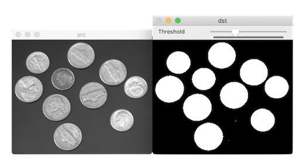

# 이진화

객체 영역(관심 영역: Region Of Interest)과 배경 영역 분리

## 전역 이진화 global binarization

픽셀 값:

- 검은색: 0
- 흰색: 255


T: threshold. 임계값. 문턱치.

### threshold

[threshold](https://docs.opencv.org/master/d7/d1b/group__imgproc__misc.html#gae8a4a146d1ca78c626a53577199e9c57)

파라미터:

- thresh: 임계값
- maxval: THRESH_BINARY 또는 THRESH_BINARY_INV 방법을 사용할 때 결과 영상의 최댓값
- type: 임계값 연산 방법. [ThresholdTypes](https://docs.opencv.org/master/d7/d1b/group__imgproc__misc.html#gaa9e58d2860d4afa658ef70a9b1115576) 열거형 상수 지정
  - 임계값 자동 결정: THRESH_OTSU, THRESH_TRIANGLE
    - 논리합 연산 `|`과 같이 사용: 기본값 `THRESH_BINARY | THRESH_OTSU`.
    - `thresh` 파라미터는 사용하지 않는다.
    - `CV_8UC1` 타입 영상만 적용 가능
  - 동작 설정: THRESH_BINARY, THRESH_BINARY_INV, THRESH_TRUNC, THRESH_TOZERO, THRESH_TOZERO_INV
- 반환값: 사용된 임계값. THRES_OTSU 또는 THRESH_TRIANGLE 방법을 사용할 때 자동으로 결정된 임계값

c++:

```cpp
double cv::threshold(InputArray src, OutputArray dst,
                     double thresh, double maxval, int type)
```

python:

```py
retval, dst = cv.threshold(src, thresh, maxval, type[, dst])
```



### 부등호 연산자

```cpp
Mat dst = src > 128;
```

## 적응형 이진화 adaptive binarization

사각형 블록 영역 내부의 픽셀 값 분포로부터 고유의 임계값 결정

임계값 결정:


- T: 임계값
- μ: (x, y) 주변 블록 영역의 픽셀 값 평균
- C: 임계값의 크기를 조정하는 상수

### adaptiveThreshold

[adaptiveThreshold](https://docs.opencv.org/master/d7/d1b/group__imgproc__misc.html#ga72b913f352e4a1b1b397736707afcde3)

파라미터:

- maxValue: 이진화 결과 영상의 최댓값
- adaptiveMethod: 적응형 이진화에서 블록 평균 계산 방법. ADAPTIVE_THRESH_MEAN_C 또는 ADAPTIVE_THRESH_GAUSSIAN_C
- thresholdType: THRESH_BINARY 또는 THRESH_BINARY_INV
- blockSize: 임계값 계산 시 사용하는 블록 크기. 3보다 같거나 큰 홀수
- C: 임계값 조정을 위한 상수. 임계값 = 블록 평균 - C

c++:

```cpp
void cv::adaptiveThreshold(InputArray src, OutputArray dst, 
                           double maxValue, 
                           int adaptiveMethod, 
                           int thresholdType, 
                           int blockSize, 
                           double C)
```

python:

```py
dst = cv.adaptiveThreshold(src, maxValue, adaptiveMethod, thresholdType, blockSize, C[, dst])
```
