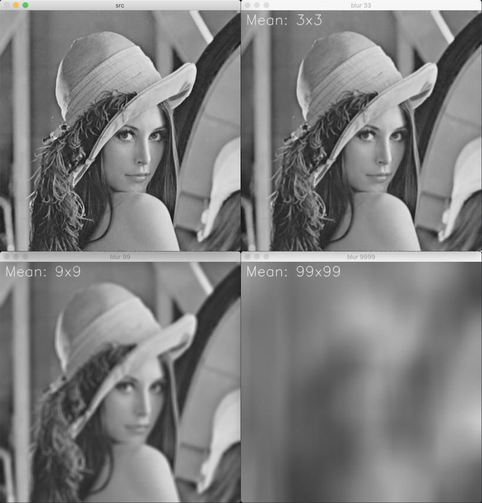
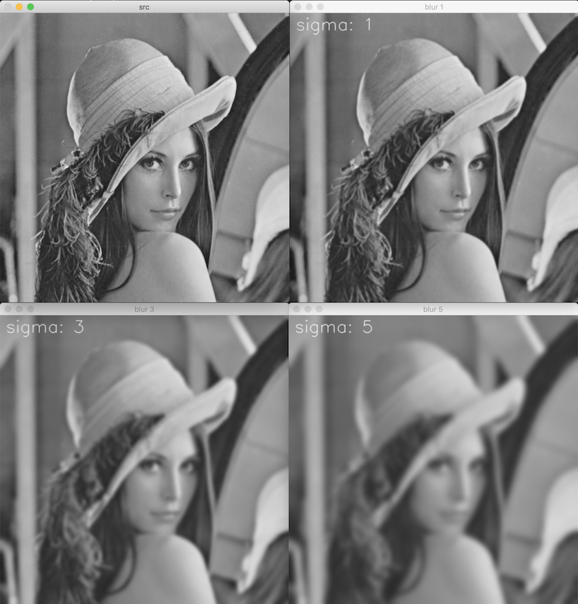

# 블러링

blurring, smoothing

## 평균값 필터 mean filter

[blur](https://docs.opencv.org/master/d4/d86/group__imgproc__filter.html#ga8c45db9afe636703801b0b2e440fce37)


c++:

```cpp
void cv::blur(InputArray src, 
              OutputArray dst, 
              Size size, 
              Point anchor = Point(-1, -1), 
              int borderType = BORDER_DEFAULT);
```

python:

```python
dst = cv.blur(src, ksize[, dst[, anchor[, borderType]]])
```



## 가우시안 필터 gaussian filter

가우시안 분포 Gaussian distribution 함수를 근사하여 생성한 필터 마스크


표준 편차 σ가 작을 수록 뾰족한 그래프가 된다.

가우시안 필터 마스크 크기는 보통 (8σ + 1)이다.

[GaussianBlur](https://docs.opencv.org/master/d4/d86/group__imgproc__filter.html#gaabe8c836e97159a9193fb0b11ac52cf1)

c++:

```cpp
void cv::GaussianBlur(InputArray src, 
                      OutputArray dst, 
                      Size size, 
                      double sigmaX,
                      double sigmaY = 0,
                      int borderType = BORDER_DEFAULT);
```

python:

```python
dst = cv.GaussianBlur(src, ksize, sigmaX[, dst[, sigmaY[, borderType]]])
```



### Gaussian Kernel


- i: 0 ~ ksize-1
- α: 

where i=0..𝚔𝚜𝚒𝚣𝚎−1 and α is the scale factor chosen so that ∑iGi=1

[getGaussianKernel](https://docs.opencv.org/master/d4/d86/group__imgproc__filter.html#gac05a120c1ae92a6060dd0db190a61afa)

c++:

```cpp
Mat cv::getGaussianKernel(int ksize, double sigma, int ktype=CV_64F)
```

python:

```python
retval = cv.getGaussianKernel(ksize, sigma[, ktype])
```
