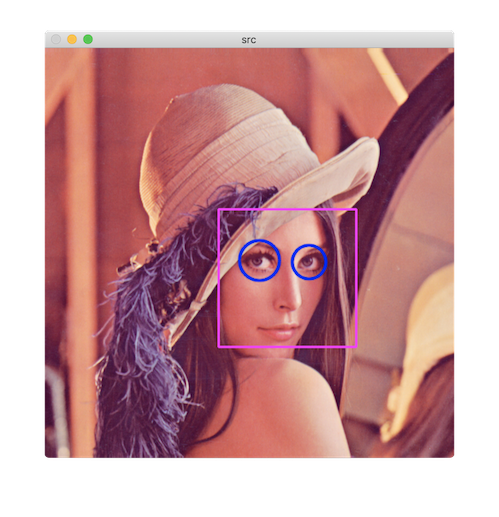

# 캐스케이드 분류기와 얼굴 검출

비올라-존스 얼굴 검출:

1. 영상 → 24 x 24 크기 정규화
2. 유사-하르 필터 집합 → 특징 정보 추출
3. 얼굴 여부 판별

유사-하르 필터 Haar-like: 흑백 사각형으로 이루어진 필터
- 합: 흰색 영역 필셀 값
- 차: 검은색 영역 픽셀 값

에이다부스트 adaboost: 18만 개 유사 하르 필터 중 효과적인 필터 선별 → 6000개

캐스케이드 구조:

1. 유사-하르 필터 1개 → 얼굴 검출 pass or fail
2. 필터 5개 → pass or fail
3. 필터 20개 → ... 반복

## 함수

### CascadeClassifier

[CascadeClassifier](https://docs.opencv.org/master/d1/de5/classcv_1_1CascadeClassifier.html)

1. CascadeClassifier 객체 생성
2. 훈련된 분류기 XML 정보 불러오기
3. 객체 검출 실행

### detectMultiScale

[detectMultiScale](https://docs.opencv.org/master/d1/de5/classcv_1_1CascadeClassifier.html#aaf8181cb63968136476ec4204ffca498)

#### 예

