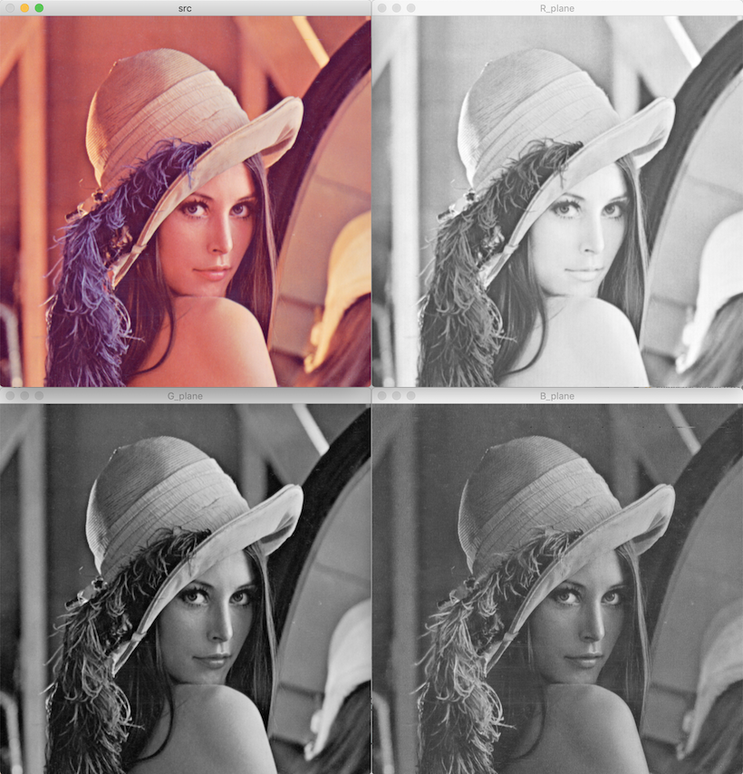

# 컬러 영상

```cpp
Mat img = imread("butterfly.jpg", IMREAD_COLOR);
```

- 3채널 컬러: BGR
- Vec3b: uchar x 3 = 3byte

## 픽셀 값

```cpp
// (0, 0) 픽셀 값
Vec3b& pixel = img.at<Vec3b>(0, 0);

uchar b1 = pixel[0];
uchar g1 = pixel[1];
uchar r1 = pixel[2];

// (3, 4)
Vec3b* ptr = img.ptr<Vec3b>(3);
uchar b3 = ptr[4][0];
uchar g3 = ptr[4][1];
uchar r3 = ptr[4][2];
```

## 색 공간 변환

- RGB color model
- RGB color space

[cvtColor](https://docs.opencv.org/master/d8/d01/group__imgproc__color__conversions.html#ga397ae87e1288a81d2363b61574eb8cab)

파라미터:

- code: 색 공간 변환 코드. [ColorConversionCodes](https://docs.opencv.org/master/d8/d01/group__imgproc__color__conversions.html#ga4e0972be5de079fed4e3a10e24ef5ef0)
- dstCn: 결과 영상의 채널 수. 0 자동 설정

c++:

```cpp
void cv::cvtColor(InputArray src,
                  OutputArray dst,
                  int code,
                  int dstCn = 0)

```

python:

```python
dst = cv.cvtColor(src, code[, dst[, dstCn]])
```

### BGR2GRAY, GRAY2BGR

BGR2GRAY: CV_8UC1


GRAY2BGR: CV_8UC3


### BGR2HSV, HSV2BGR


- Hue: 색상. 0 ~ 179.
- Saturation: 채도. 0 ~ 255.
- Value: 명도. 0 ~ 255.

색상 값:

- 0 ~ 360 정수 → 2로 나눠 uchar 자료형으로 저장한다.
- 0 ~ 1로 정규화된 CV_32FC3 BGR 영상: H 0 ~ 360 실수형. S, V 0 ~ 1 실수형

### BGR2YCrCb, YCrCb2BGR


- Y: luminance. 휘도, 밝기. 0 ~ 255 or 0 ~ 1 실수
- Cr, Cb: chrominance. 색상, 색차. 0 ~ 255 or 0 ~ 1 실수

## 색상 채널 분리

### split

[split](https://docs.opencv.org/master/d2/de8/group__core__array.html#ga0547c7fed86152d7e9d0096029c8518a)

파라미터:

- src: 입력 다채널 행렬
- mvbegin: 분리된 1채널 행렬을 저장할 Mat 배열 주소. 영상 배열 수 = src 영상 채널 수
- mv: 분리된 1채널 행렬을 저장할 벡터

c++:

```cpp
void cv::split(const Mat & src, Mat * mvbegin)
void cv::split(InputArray m, OutputArrayOfArrays mv)
```

python:

```python
mv = cv.split(m[, mv])
```

### merge

[split](https://docs.opencv.org/master/d2/de8/group__core__array.html#ga0547c7fed86152d7e9d0096029c8518a)

파라미터:

- mv: 분리된 1채널 행렬을 저장하고 있는 배열 또는 벡터. 모든 행렬은 크기와 깊이가 같다
- count: Mat 배열 크기
- dst: 출력 다채널 행렬

c++:

```cpp
void cv::merge(const Mat * mv, size_t count, OutputArray dst)
void cv::merge(InputArrayOfArrays mv, OutputArray dst)
```

python:

```python
dst = cv.merge(mv[, dst])
```


