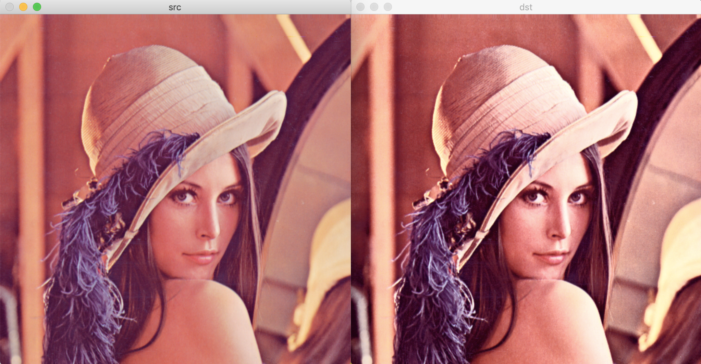
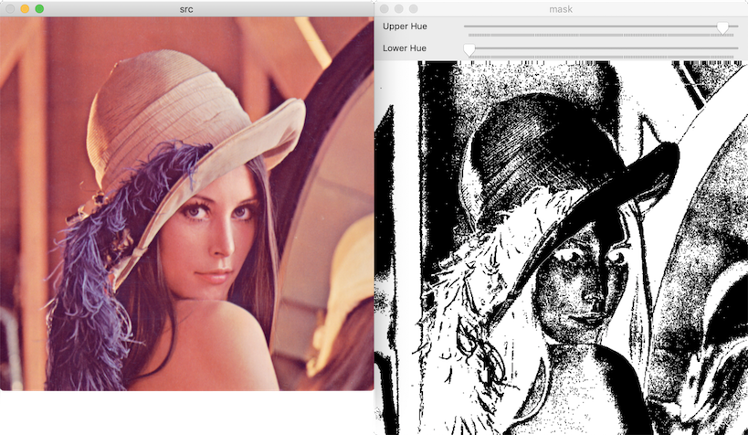
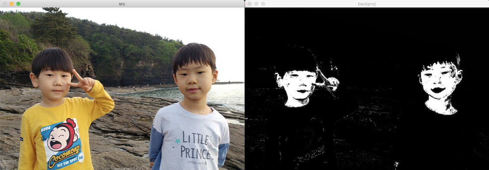

# 컬러 영상 처리

## 컬러 히스토그램 평활화

입력 영상 → 밝기 정보 + 색상 정보 분리 → 밝기 정보 히스토그램 평활화

YCrCb → Y + CrCb → Y 히스토그램 평활화



## 색상 범위 지정에 의한 영역 분할

특정 색상 영역 추출: HSV 이용

### inRange

- 원소 값이 특정 범위 안에 있는지 확인하는 함수.
- 범위 안에 들어있으면 255 흰색. 그외는 0 검은색. 영상 반환.
- 다채널인 경우 모든 채널이 범위 안에 들었을 때 255.

[inRange](https://docs.opencv.org/master/d2/de8/group__core__array.html#ga48af0ab51e36436c5d04340e036ce981)

파라미터:

- lowerb: 하한 값. 주로 Mat 또는 Scalar 객체 지정
- upperb: 상한 값. 주로 Mat 또는 Scalar 객체 지정
- dst: 출력 마스크 영상. CV_8UC1

c++:

```cpp
void cv::inRange(InputArray src,
                 InputArray lowerb,
                 InputArray upperb,
                 OutputArray dst)
```

python:

```python
dst = cv.inRange(src, lowerb, upperb[, dst])
```



## 히스토그램 역투영

histogram backprojection

1. 기준 영상에서 찾고자 하는 컬러 히스토그램 선택
2. 입력 영상에서 해당 히스토그램에 부합하는 영역 찾기

### calcBackProject

[calcBackProject](https://docs.opencv.org/master/d6/dc7/group__imgproc__hist.html#ga3a0af640716b456c3d14af8aee12e3ca)

파라미터:

- images: 입력 영상의 배열 또는 입력 영상의 주소
- nimages: 입력 영상 개수
- channels: 역투영 계산 시 사용할 채널 번호 배열
- hist: 입력 히스토그램
- backProject: 출력 히스토그램 역투영 영상. 1채널 영상
- ranges: 각 차원의 히스토그램 빈 범위를 나타내는 배열의 배열
- scale: 히스토그램 역투영 값에 추가적으로 곱할 값
- uniform: 히스토그램 빈의 간격이 균등한지를 나타내는 플래그

c++:

```cpp
void cv::calcBackProject(const Mat * images,
                         int nimages,
                         const int * channels,
                         InputArray hist,
                         OutputArray backProject,
                         const float ** ranges,
                         double scale = 1,
                         bool uniform = true)
void cv::calcBackProject (const Mat * images,
                         int nimages,
                         const int * channels,
                         const SparseMat & hist,
                         OutputArray backProject,
                         const float ** ranges,
                         double scale = 1,
                         bool uniform = true)
void cv::calcBackProject (InputArrayOfArrays images,
                         const std::vector< int > & channels,
                         InputArray hist,
                         OutputArray dst,
                         const std::vector< float > & ranges,
                         double scale)
```

python:

```python
dst = cv.calcBackProject(images, channels, hist, ranges, scale[, dst])
```


