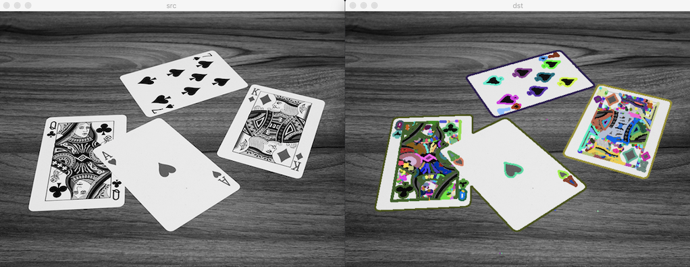
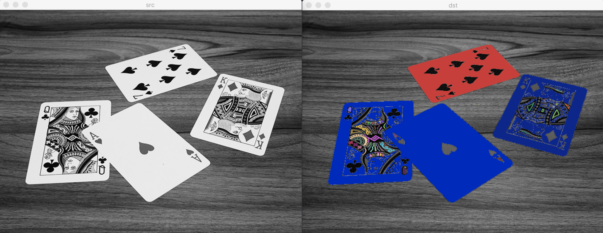
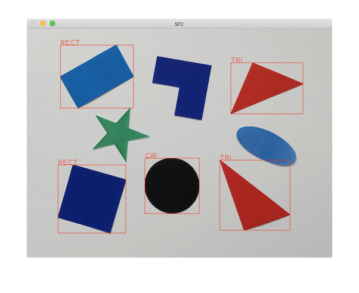

# 외곽선 검출

객체 영역 픽셀 중에서 배경 영역과 인접한 일련의 픽셀

## 외곽선 검출

- `vector<Point>`: 외곽선 정보 1개
- `vector<vector<Point>> contours;`: 영상 전체 외곽선 정보

### 검출 함수

[findContours](https://docs.opencv.org/master/d3/dc0/group__imgproc__shape.html#gadf1ad6a0b82947fa1fe3c3d497f260e0)

파라미터:

- contours: 검출된 외곽선 정보. `vector<vector<Point>>`
- hierarchy: 외곽선 계층 정보. `vector<Vec4i>`
  - `hierarchy[i][0]`: 다음 외곽선 번호
  - `hierarchy[i][1]`: 이전 외곽선 번호
  - `hierarchy[i][2]`: 자신 외곽선 번호
  - `hierarchy[i][3]`: 부모 외곽선 번호
  - 해당 외곽선이 존재하지 않으면 `-1` 저장
- mode: 외곽선 검출 모드. [RetrievalModes](https://docs.opencv.org/master/d3/dc0/group__imgproc__shape.html#ga819779b9857cc2f8601e6526a3a5bc71)
  - RETR_EXTERNAL: 객체 바깥쪽 외곽선만 검색. 계층 구조 만들지 않음
  - RETR_LIST: 객체 바깥쪽과 안쪽 외곽선 모두 검색. 계층 구조 만들지 않음
  - RETR_CCOMP: 모든 외곽선 검색 후 2단계 계층 구조 구성 
  - RETR_TREE: 모든 외곽선 검색 후 전체 계층 구조 구성
- method: 외곽선 근사화 방법. [ContourApproximationModes](https://docs.opencv.org/master/d3/dc0/group__imgproc__shape.html#ga4303f45752694956374734a03c54d5ff)
  - CHAIN_APPROX_NONE: 모든 외곽선 점 좌표 저장
  - CHAIN_APPROX_SIMPLE: 외곽선 중 수평선, 수직선, 대각선 성분은 끝점만 저장. 외곽선 점 개수 줄어듦
  - CHAIN_APPROX_TC89_L1, CHAIN_APPROX_TC89_KCOS: 외곽선 점 개수 줄어듦. 외곽선 모양 변화함
- offset: 외곽선 점 좌표의 오프셋(이동 변위)

c++:

```cpp
void cv::findContours(InputArray image, OutputArrayOfArrays contours, OutputArray hierarchy, 
                      int mode, int method, Point offset = Point())
void cv::findContours(InputArray image, OutputArrayOfArrays contours,
                      int mode, int method, Point offset = Point())
```

python:

```py
contours, hierarchy = cv.findContours(image, mode, method[, contours[, hierarchy[, offset]]])
```

### 그리기 함수

[drawContours](https://docs.opencv.org/master/d6/d6e/group__imgproc__draw.html#ga746c0625f1781f1ffc9056259103edbc)

파라미터:

- contours: `findContours()` 함수로 구한 전체 외곽선 정보
- contourIdx: 외곽선 번호. 음수 = 전체 외곽선
- color: 외곽선 색상 또는 밝기
- thickness: 외곽선 두께. 
  - FILLED 또는 -1: 내각선 외부 채움
- lineType: 외곽선 타입
- hierarchy: 외곽선 계층 정보
- maxLevel: 외곽선 최대 레벨.
  - 0: 지정한 번호의 외곽선만 그리기
  - 1과 같거나 큰 수: 하위 레벨의 외곽선 그리기
- offset: 추가적으로 지정할 외곽선 점 좌표의 오프셋(이동 변위). 지정한 좌표 크기만큼 이동하여 그리기.

c++:

```cpp
void cv::drawContours(InputOutputArray image,
                      InputArrayOfArrays contours,
                      int contourIdx,
                      const Scalar & color,
                      int thickness = 1,
                      int lineType = LINE_8,
                      InputArray hierarchy = noArray(),
                      int maxLevel = INT_MAX,
                      Point offset = Point())
```

python:

```py
image = cv.drawContours(image, contours, contourIdx, color[, thickness[, lineType[, hierarchy[, maxLevel[, offset]]]]])
```





## 외곽선 처리 함수

### boundingRect

외곽선 점들을 감싸는 최소 크기의 사각형

- 이미 외곽선 정보를 가지고 있는 경우에 사용.
- 참고: connectComponentsWithStats

[boundingRect](https://docs.opencv.org/master/d3/dc0/group__imgproc__shape.html#ga103fcbda2f540f3ef1c042d6a9b35ac7)

파라미터:

- points: 입력 점들의 집합.
- 반환값: 최소 크기의 사각형

c++:

```cpp
Rect cv::boundingRect(InputArray array)
```

python:

```py
retval = cv.boundingRect(array)
```

### minAreaRect

외곽선 또는 점을 감싸는 최소 크기의 회전된 사각형

[minAreaRect](https://docs.opencv.org/master/d3/dc0/group__imgproc__shape.html#ga3d476a3417130ae5154aea421ca7ead9)

c++:

```cpp
RotatedRect cv::minAreaRect(InputArray points)
```

python:

```py
retval = cv.minAreaRect(points)
```

### minEnclosingCircle

외곽선 또는 점을 감싸는 최소 크기의 원

[minEnclosingCircle](https://docs.opencv.org/master/d3/dc0/group__imgproc__shape.html#ga8ce13c24081bbc7151e9326f412190f1)

c++:

```cpp
void cv::minEnclosingCircle(InputArray points, Point2f & center, float & radius)
```

python:

```py
center, radius = cv.minEnclosingCircle(points)
```

### arcLength

임의의 곡선을 형성하는 점들의 집합을 가지고 있을 때, 해당 곡선의 길이 구하는 함수

[arcLength](https://docs.opencv.org/master/d3/dc0/group__imgproc__shape.html#ga8d26483c636be6b35c3ec6335798a47c)

파라미터:

- curve: 입력 곡선
- closed: 폐곡선 여부
- 반환값: 입력 곡선의 길이

c++:

```cpp
double cv::arcLength(InputArray curve, bool closed)
```

python:

```py
retval = cv.arcLength(curve, closed)
```

### contourArea

외곽선이 감싸는 영역의 면적

[contourArea](https://docs.opencv.org/master/d3/dc0/group__imgproc__shape.html#ga2c759ed9f497d4a618048a2f56dc97f1)

파라미터:

- curve: 입력 곡선
- oriented: 진행 방향 정보 사용 여부
  - true: 곡선의 진행 방향에 따라 면적의 부호 달라짐
  - false: 면적의 절대값 반환
- 반환값: 입력 곡선의 길이

c++:

```cpp
double cv::contourArea(InputArray contour, bool oriented = false)
```

python:

```py
retval = cv.contourArea(contour[, oriented])
```

### approxPolyDP

외곽선 또는 곡선을 근사화

- 주어진 곡선의 형태를 단순화하여 작은 개수의 점으로 구성된 곡선 생성
- Douglas-Peucker 알고리즘 사용
  1. 입력 외곽선에서 가장 멀리 떨어져 있는 두 점
  2. 직선으로 연결
  3. 해당 직선에서 가장 멀리 떨어져 있는 외곽선상의 점을 찾아 근사화 점으로 추가
  4. 반복
  5. 새로 추가할 외곽선상의 점과 근사화에 의한 직선과의 수직 거리가 epsilon 인자보다 작으면 근사화 멈춤

[approxPolyDP](https://docs.opencv.org/master/d3/dc0/group__imgproc__shape.html#ga0012a5fdaea70b8a9970165d98722b4c)

파라미터:

- curve: 입력. 2차원 점들의 좌표
- approxCurve: 출력. 근사화된 점들의 좌표
- epsilon: 근사화 정밀도 파라미터. 입력 곡선과 근사화된 곡선까지의 최대 거리를 지정
  - 입력 외곽선 또는 곡선 길이의 일정 비율로 지정 (예: `arcLength(curve, true) * 0.0`)
- closed: 폐곡선 여부

c++:

```cpp
double cv::contourArea(InputArray contour, bool oriented = false)
```

python:

```py
retval = cv.contourArea(contour[, oriented])
```


