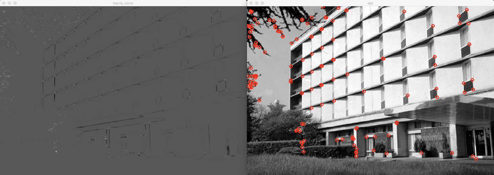
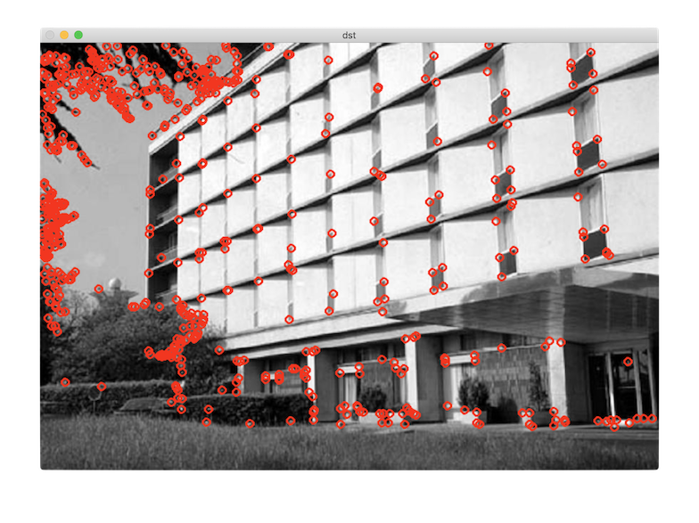

# 코너 검출

- feature: 영상 안의 유용한 정보
  - 평균 밝기, 히스토그램, 에지, 직선 성분, 코너
- local feature: 일부 영역의 특징. 
  - 에지, 직선 성분, 코너
- feature point: 한 점 형태로 표현할 수 있는 특징
  - keypoint, interest point
  - 코너

코너: 에지 방향이 급격하게 변하는 부분

## 해리스 코너 검출

코너 응답 함수 R:
- 0 이상 큰 양수: 코너
- 0 가까운 실수: 평탄한 영역
- 0 보다 작은 음수: 에지

### 함수

[cornerHarris](https://docs.opencv.org/master/dd/d1a/group__imgproc__feature.html#gac1fc3598018010880e370e2f709b4345)

## FAST 코너 검출

- 주변 16개 픽셀과 밝기를 비교하여 코너 여부 판별
- 코너 점수: 16개 점과 픽셀 값 차이 합
- 비최대 억제 작업: 인접 코너 중 코너 점수가 가장 큰 코너를 최종 코너로 선택

[FAST](https://docs.opencv.org/master/d5/d51/group__features2d__main.html#ga816d870cbdca71c6790c71bdf17df099)

