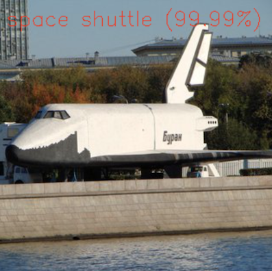
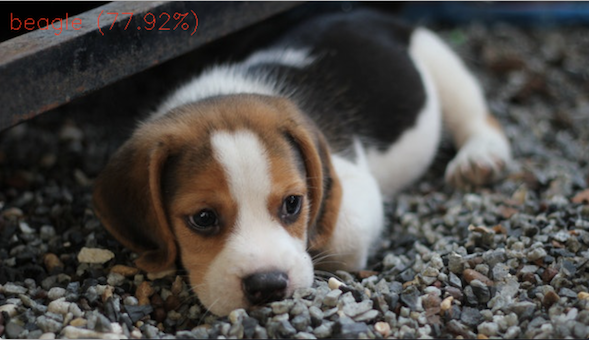
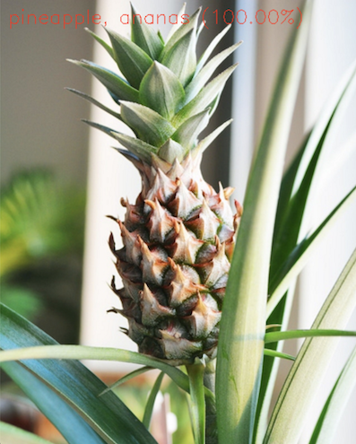
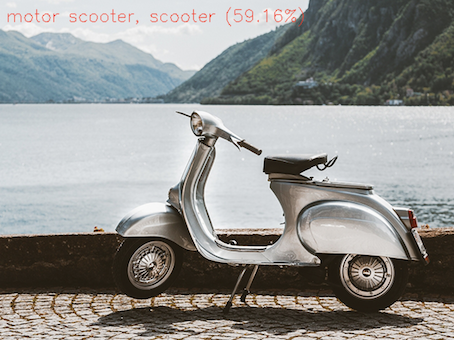

# OpenCV와 딥러닝 활용

## 사진 인식

다운로드: [구글넷 모델 파일](http://dl.caffe.berkeleyvision.org/bvlc_googlenet.caffemodel)

- 학습 모델 파일: bvlc_googlenet.caffemodel
- 구성 파일: deploy.prototxt
- 클래스 이름 파일: classification_classes_ILSVRC2012.txt

## 얼굴 인식

- 모델: [Caffe 프레임워크 훈련 파일](https://raw.githubusercontent.com/opencv/opencv_3rdparty/dnn_samples_face_detector_20180205_fp16/res10_300x300_ssd_iter_140000_fp16.caffemodel)
- 모델: [Tensorflow 훈련 파일](https://raw.githubusercontent.com/opencv/opencv_3rdparty/dnn_samples_face_detector_20180220_uint8/opencv_face_detector_uint8.pb)

- 구성 파일: deploy.2.prototxt
- 클래스 이름 파일: opencv_face_detector.pbtxt
