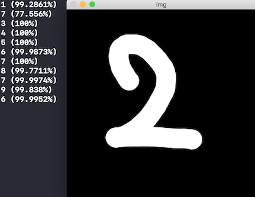

# 딥러닝 학습과 OpenCV 실행

## 숫자 인식

### 모델 생성

```bash
python mnist_cnn.py
```

```bash
Start learning!
Epoch: 0001 Avg. cost =  0.1681
Epoch: 0002 Avg. cost =  0.0467
...
Epoch: 0020 Avg. cost =  0.0049
Learning finished!
Save done!
```

### 결과


