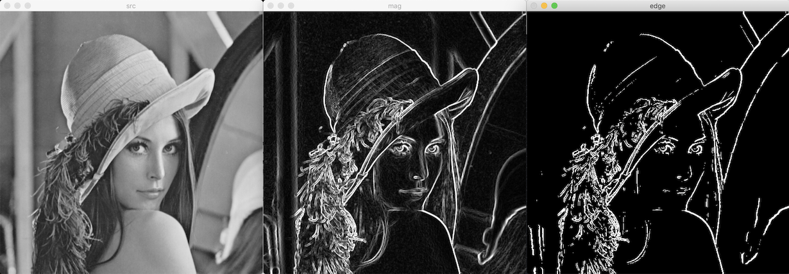
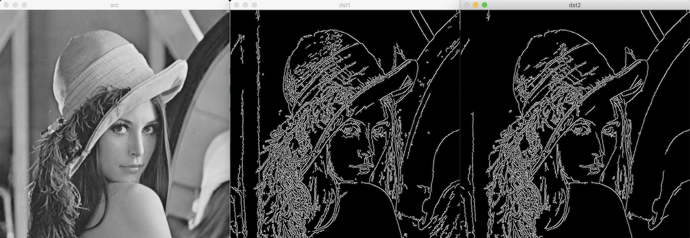

# 에지 검출

- 픽셀 값이 한쪽 방향으로 급격하게 바뀌는 부분
- 픽셀 값의 변화율을 이용한다
- 객체 판별을 위한 전처리롤 사용된다

## 미분

**derivative**: 함수의 순간 변화율

1차원 연속 함수 f(x)의 미분:


전진 차분 forward difference:


후진 차분 backward difference:


**중앙 차분 centered difference**: 이론적으로 근사화 오류가 가장 적다


영상 특징:

1. 영상 = 2차원 평면에서 정의된 함수
2. 영상 = 정수 단위 좌표에 픽셀이 나열된 이산함수
3. 편미분 partial derivative: 가로, 세로 각각 미분

중앙 차분 방법으로 근사화한 편미분 방정식:


필터 마스크:

편미분 근사 수식과 같이 그대로 1/2를 곱하지 않고  
단순하게 상용한다.  
(미분 값의 상대적 크기가 중요하기 때문이다)

- X축 1x3: [-1, 0, 1]
- Y축 3x1: [-1, 0, 1]

그래디언트 gradient:

2차원 함수 f(x, y)의 편미분을 한번에 벡터로 표현.  
두 편미분 (벡터)의 합.


벡터 크기: magnitude


벡터 방향: phase

밝기가 가장 밝아지는 방향을 가리킨다.


에지 방향: 그래디언트 벡터와 수직

## 마스크 기반 에지 검출

마스크 크기 클수록 영상 잡음의 영향이 줄어든다.

**Sobel filter:**

 

### Sobel 미분

[Sobel](https://docs.opencv.org/master/d4/d86/group__imgproc__filter.html#gacea54f142e81b6758cb6f375ce782c8d)


파라미터:

- dx: x 방향 미분 차수
- dy: y 방향 미분 차수
- ksize: 소벨 커널의 크기
- scale: 필터링 연산 후 추가적으로 곱할 값
- delta: 필터링 연산 후 추가적으로 더할 값

c++:

```cpp
void cv::Sobel(InputArray src,
               OutputArray dst,
               int ddepth,
               int dx,
               int dy,
               int ksize = 3,
               double scale = 1,
               double delta = 0,
               int borderType = BORDER_DEFAULT)
```

python:

```python
dst = cv.Sobel(src, ddepth, dx, dy[, dst[, ksize[, scale[, delta[, borderType]]]]])
```

### Scharr 미분

[Scharr](https://docs.opencv.org/master/d4/d86/group__imgproc__filter.html#gaa13106761eedf14798f37aa2d60404c9)

c++:

```cpp
void cv::Scharr(InputArray src,
                OutputArray dst,
                int ddepth,
                int dx,
                int dy,
                double scale = 1,
                double delta = 0,
                int borderType = BORDER_DEFAULT)
```

python:

```python
dst = cv.Scharr(src, ddepth, dx, dy[, dst[, scale[, delta[, borderType]]]])
```

### magnitude 그래디언트 크기

[magnitude](https://docs.opencv.org/master/d2/de8/group__core__array.html#ga6d3b097586bca4409873d64a90fe64c3)

파라미터:

- x: 벡터의 x 좌표를 나타내는 실수 행렬 또는 벡터
- y: 벡터의 y 좌표를 나타내는 실수 행렬 또는 벡터
- magnitude: 벡터의 크기를 나타내는 실수 행렬 또는 벡터

c++:

```cpp
void cv::magnitude(InputArray x,
                   InputArray y,
                   OutputArray magnitude)
```

python:

```python
magnitude = cv.magnitude(x, y[, magnitude])
```

### phase 그래디언트 방향

[phase](https://docs.opencv.org/master/d2/de8/group__core__array.html#ga9db9ca9b4d81c3bde5677b8f64dc0137)

파라미터:

- x: 벡터의 x 좌표를 나타내는 실수 행렬 또는 벡터
- y: 벡터의 y 좌표를 나타내는 실수 행렬 또는 벡터
- angle: 벡터의 방향을 나타내는 실수 행렬 또는 벡터
- angleInDegrees: 기본값 라디안. 각도, 라디안.

c++:

```cpp
void cv::phase(InputArray x,
               InputArray y,
               OutputArray angle
               bool angleInDegrees = false)
```

python:

```python
angle = cv.phase(x, y[, angle[, angleInDegrees]])
```



## Canny 에지 검출기

좋은 에지 검출기 조건:

1. 정확한 검출: good detection
2. 정확한 위치: good localization
3. 단일 에지: single edge

연산 과정:

1. 가우시안 필터링: 영상 잡음 제거. 생략 가능
2. 그래디언트 계산: 소벨 마스크 필터링 후 그래디언트 크기, 방향 계산
   - L2 norm: 
   - **L1 norm**: 
3. 비최대 억제: non-maximum suppression.
   - 그래디언트 크기가 국지적 최대(local maximum)인 픽셀만 에지 픽셀로 설정
   - 특정 픽셀을 둘러싸고 있는 모든 픽셀 값을 검사하여 국지적 최대인지 판별
   - 그래디언트 벡터의 방향과 같은 방향에 있는 인접 픽셀끼리만 국지적 최대 검사 수행
   - 가장 변화율이 큰 위치의 픽셀만 에지로 검색됨
4. 이중 임계값을 이용한 히스테리시스 에지 트래킹
   - T<sub>High</sub>
     - < 픽셀 값: 에지 O
     - > 픽셀 값: 에지 X
   - T<sub>Low</sub> < 픽셀 값 < T<sub>High</sub> : 추가 검사
     - T<sub>High</sub>보다 큰 픽셀과 연결 O: 에지 O
     - T<sub>High</sub>보다 큰 픽셀과 연결 X: 에지 X

### Canny

[Canny](https://docs.opencv.org/master/dd/d1a/group__imgproc__feature.html#ga04723e007ed888ddf11d9ba04e2232de)

함수:

1. 일반 영상 입력
2. 미분 영상 입력

파라미터:

- threshold1: 낮은 임계값
- threshold2: 높은 임계값
- apertureSize: 소벨 마스크 크기
- L2gradient: 기본값 L1 norm

c++:

```cpp
void cv::Canny(InputArray image,
               OutputArray edges,
               double threshold1,
               double threshold2,
               int apertureSize = 3,
               bool L2gradient = false)
void cv::Canny(InputArray dx,
               InputArray dy,
               OutputArray edges,
               double threshold1,
               double threshold2,
               bool L2gradient = false)
```

python:

```python
edges = cv.Canny(image, threshold1, threshold2[, edges[, apertureSize[, L2gradient]]])
edges = cv.Canny(dx, dy, threshold1, threshold2[, edges[, L2gradient]])
```


