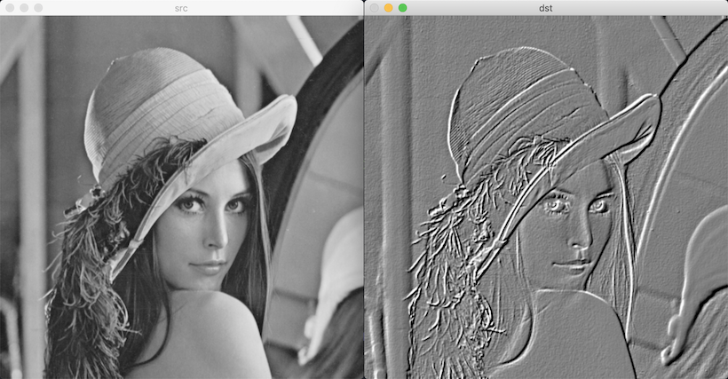

# 필터링

- 필터링: 영상에서 원하는 정보만 통과시키고 원치 낳는 정보는 걸러 내는 작업
- 마스크 mask: 필터링의 성격을 정의하는 행렬. 커널 kernel. 윈도우 window. 필터.
  - 고정점 anchor point: 대부분 행렬의 정중앙

## 마스크 연산


### 가장자리 픽셀 확장 방법

[BorderTypes](https://docs.opencv.org/master/d2/de8/group__core__array.html#ga209f2f4869e304c82d07739337eae7c5)

대부분 실제 영상의 픽셀 값을 대칭 형태로 가상의 픽셀을 만든 후 연산한다.

### 함수

[filter2D](https://docs.opencv.org/master/d4/d86/group__imgproc__filter.html#ga27c049795ce870216ddfb366086b5a04)

파라미터:

- ddepth: 결과 영상의 깊이
- kernel: 필터링 커널. 1채널 실수형 행렬
- anchor: 고정점 좌표. Point(-1, -1)을 지정하면 커널 중심을 고정점으로 사용합니다.
- delta: 필터링 연산 후 추가적으로 더할 값
- borderType: 가장자리 픽셀 확장 방식

c++:

```cpp
void filter2D(InputArray src, 
              OutputArray dst, 
              int ddepth, 
              InputArray kernel, 
              Point anchor = Point(-1, -1), 
              double delta = 0, 
              int borderType = BORDER_DEFAULT);
```

python:

```python
dst = cv.filter2D(src, ddepth, kernel[, dst[, anchor[, delta[, borderType]]]])
```

## 엠보싱 필터링

|     |     |     |
| --- | --- | --- |
| -1  | -1  | 0   |
| -1  | 0   | 1   |
| 0   | 1   | 1   |


