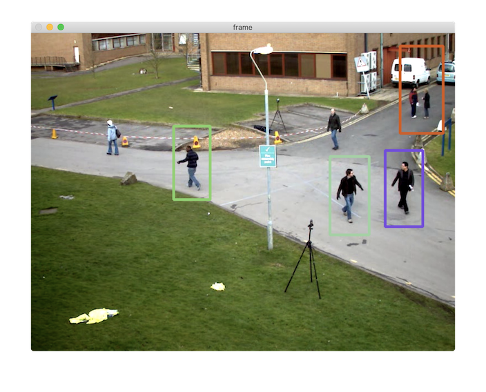

# HOG 알고리즘과 보행자 검출

Histograms of Oriented Gradients: 그래디언트 방향 히스토그램

- 방향성이 있는 그래디언트의 히스토그램
- 알고리즘: 그래디언트 방향 성분에 대한 히스토그램

알고리즘:

1. 64x128 크기 영상
2. 그래디언트 (크기와 방향) 계산
   - 방향: 0 ~ 180도
3. Cell 분할: 8x8 크기 단위
   - 가로 8, 세로 16
4. 각 셀로부터 그래디언트 방향 성분에 대한 히스토그램 계산
   - 방향 성분 단위: 20도
   - 총 9개 빈 방향 히스토그램: 20도 x 9 = 180도
   - Block: 인접한 4개 셀. 
     - 36개 실수 값으로 이루어진 방향 히스토그램
     - 가로 7, 세로 15
     - 총 105개
     - 실수 값: 105 x 36 = **3780** → **HOG 특징 벡터 역할**

## 함수

### HOGDescriptor

[HOGDescriptor](https://docs.opencv.org/master/d5/d33/structcv_1_1HOGDescriptor.html)

### getDefaultPeopleDetector

- HOG 기술자 정보 반환
- 분류기 계수 반환

[getDefaultPeopleDetector](https://docs.opencv.org/master/d5/d33/structcv_1_1HOGDescriptor.html#a9c7a0b2aa72cf39b4b32b3eddea78203)

### setSVMDetector

- 훈련된 SVM 분류기 계수

[setSVMDetector](https://docs.opencv.org/master/d5/d33/structcv_1_1HOGDescriptor.html#a6de5ac55631eed51e36278cde3a2c159)

### detectMultiScale

[detectMultiScale](https://docs.opencv.org/master/d5/d33/structcv_1_1HOGDescriptor.html#a91e56a2c317392e50fbaa2f5dc78d30b)

#### 예

