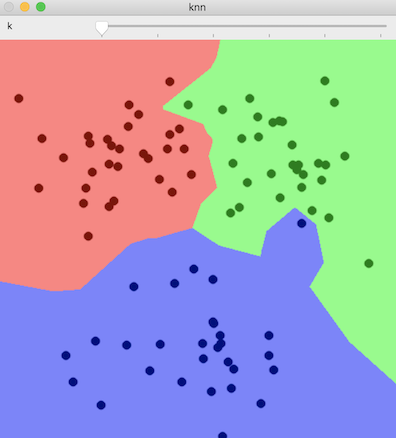
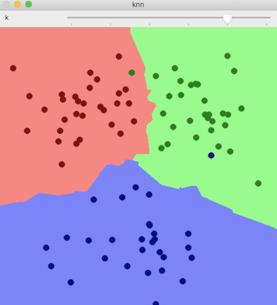
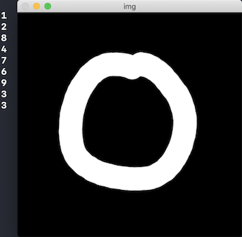

# k 최근접 이웃

kNN, k-Nearest Neighbor

분류:
1. 특징 공간에서 테스트 데이터와 가장 가까운 k개의 훈련 데이터를 찾는다.
2. k개의 훈련 데이터 중에서 가장 많은 클래스를 테스트 데이터의 클래스로 지정한다.

회귀:
1. 특징 공간에서 테스트 데이터와 가장 가까운 k개의 훈련 데이터를 찾는다.
2. k개의 훈련 데이터 평균을 테스트 데이터 값으로 설정


## KNearest

[cv::ml::KNearest](https://docs.opencv.org/master/dd/de1/classcv_1_1ml_1_1KNearest.html)

### create

객체 생성 함수

[create](https://docs.opencv.org/master/dd/de1/classcv_1_1ml_1_1KNearest.html#ab0ce3fa7a242f3418938592f4d935b81)

c++:

```cpp
static Ptr<KNearest> cv::ml::KNearest::create()
```

python:

```python
retval = cv.ml.KNearest_create()
```

### setDefaultK

[setDefaultK](https://docs.opencv.org/master/dd/de1/classcv_1_1ml_1_1KNearest.html#a0e4bbe73142a27fda05f73125b1ed5ef)

파라미터:

- val: kNN 알고리즘에서 사용할 k 값. (기본값 10)

c++:

```cpp
virtual void cv::ml::KNearest::setAlgorithmType(int val)
```

python:

```python
None = cv.ml_KNearest.setAlgorithmType(val)
```

### setIsClassifier

KNearest 객체는 분류로 사용한다. 회귀에 적용하려면 값을 false로 지정한다.

[setIsClassifier](https://docs.opencv.org/master/dd/de1/classcv_1_1ml_1_1KNearest.html#adf7439615632c768fa0bd448615e09e8)

파라미터:

- val
  - true: 분류
  - false: 회귀

c++:

```cpp
virtual void cv::ml::KNearest::setIsClassifier(bool val)
```

python:

```python
None = cv.ml_KNearest.setIsClassifier(val)
```

### findNearest

[findNearest](https://docs.opencv.org/master/dd/de1/classcv_1_1ml_1_1KNearest.html#a312f975c24725b57200e221a97474b45)

파라미터:

- samples: 테스트 데이터 벡터가 행 단위로 저장된 행렬. CV_32FC1
- k: 사용할 최근접 이웃 개수. 1보다 같거나 크다.
- results: 각 입력 샘플에 대한 예측(분류 또는 회귀) 결과를 저장한 행렬. `samples.rows * 1` 크기
- neighborResponses: 예측에 사용된 k개의 최근접 이웃 클래스 정보를 담고 있는 행렬. `samples.rows * k` 크기
- dist: 입력 벡터와 예측에 사용된 k개의 최근접 이웃과의 거리를 저장한 행렬. `samples.rows * k` 크기
- 반환값: 입력 벡터가 하나인 경우에 대한 응답이 반환

c++:

```cpp
virtual float cv::ml::KNearest::findNearest(InputArray samples, int k, OutputArray results, OutputArray neighborResponses = noArray(), OutputArray dist = noArray()) const
```

python:

```python
retval, results, neighborResponses, dist = cv.ml_KNearest.findNearest(samples, k[, results[, neighborResponses[, dist]]])
```




## 필기체 숫자 인식

- 숫자 데이터: 20x20 크기 숫자 * 5000개. 2000x1000 크기 영상
- 훈련 데이터: 20x20 → 1x400 크기 행렬로 변환. 5000x400 행렬


