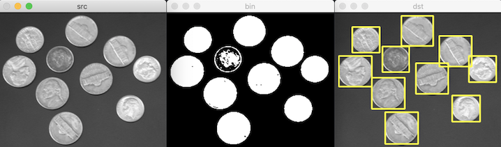

# 레이블링

- 이진 영상에서 흰색으로 구분된 각 객체 영역에 고유의 번호를 지정하는 기법
- 각 객체의 위치, 크기, 모양 등 특징 분석 가능

## 기본

연결된 구성 요소 레이블링: connected components labeling

- 입력 영상 픽셀 값 0: 배경
- 나머지 픽셀 값: 객체

연결 관계:

- 4-방향 연결성: 4-way connectivity
- 8-방향 연결성: 8-way connectivity

레이블 맵 label map: 2차원 정수 행렬. 레이블링 수행 결과

### 레이블링 함수

[connectedComponents](https://docs.opencv.org/master/d3/dc0/group__imgproc__shape.html#gaedef8c7340499ca391d459122e51bef5)

파라미터:

- image: 입력 영상. CV_8UC1, CV_8SC1
- labels: 출력 레이블 맵 행렬
- connectivity: 연결성. 4, 8
- ltype: 출력 행렬 타입. CV_32S, CV_16S
- 반환갑: 레이블 개수 N.
  - 0: 배경
  - 1 ~ N-1: 레이블

c++:

```cpp
int cv::connectedComponents(InputArray image, OutputArray labels, int connectivity, int ltype, int ccltype)
int cv::connectedComponents(InputArray image, OutputArray labels, int connectivity = 8, int ltype = CV_32S)
```

python:

```py
retval, labels = cv.connectedComponents(image[, labels[, connectivity[, ltype]]])
retval, labels = cv.connectedComponentsWithAlgorithm(image, connectivity, ltype, ccltype[, labels])
```

### 구현

src:

```bash
[  0,   0, 255, 255,   0,   0,   0,   0;
 255, 255, 255, 255,   0,   0, 255,   0;
 255, 255, 255, 255,   0,   0,   0,   0;
   0,   0,   0,   0,   0, 255, 255,   0;
   0,   0,   0, 255, 255, 255, 255,   0;
   0,   0,   0, 255,   0,   0, 255,   0;
   0,   0, 255, 255, 255, 255, 255,   0;
   0,   0,   0,   0,   0,   0,   0,   0]
```

labels:

```bash
[0, 0, 1, 1, 0, 0, 0, 0;
 1, 1, 1, 1, 0, 0, 2, 0;
 1, 1, 1, 1, 0, 0, 0, 0;
 0, 0, 0, 0, 0, 3, 3, 0;
 0, 0, 0, 3, 3, 3, 3, 0;
 0, 0, 0, 3, 0, 0, 3, 0;
 0, 0, 3, 3, 3, 3, 3, 0;
 0, 0, 0, 0, 0, 0, 0, 0]
```

```bash
number of labels: 4
```

## 응용

### 레이블링 통계 함수

[connectedComponentsWithStats](https://docs.opencv.org/master/d3/dc0/group__imgproc__shape.html#ga107a78bf7cd25dec05fb4dfc5c9e765f)

파라미터:

- stats: 각각의 레이블 영역에 대한 통계 정보를 담은 행렬. CV_32S
  - (x, y, width, height, 픽셀 수)
- centroids: 각각 레이블 영역의 무게 중심 좌표 정보를 담은 행렬. CV_64F
  - (무게 중심의 x 좌표, 무게 중심의 y 좌표)
  - (x 좌표 합 / 픽셀 수, y 좌표 합 / 픽셀 수)

c++:

```cpp
int cv::connectedComponentsWithStats(InputArray image,
                                     OutputArray labels, OutputArray stats, OutputArray centroids,
                                     int connectivity, int ltype, int ccltype)
int cv::connectedComponentsWithStats(InputArray image, 
                                     OutputArray labels, OutputArray stats, OutputArray centroids,
                                     int connectivity = 8, int ltype = CV_32S)
```

python:

```py
retval, labels, stats, centroids = cv.connectedComponentsWithStats(image[, labels[, stats[, centroids[, connectivity[, ltype]]]]])
retval, labels, stats, centroids = cv.connectedComponentsWithStatsWithAlgorithm(image, connectivity, ltype, ccltype[, labels[, stats[, centroids]]])
```


