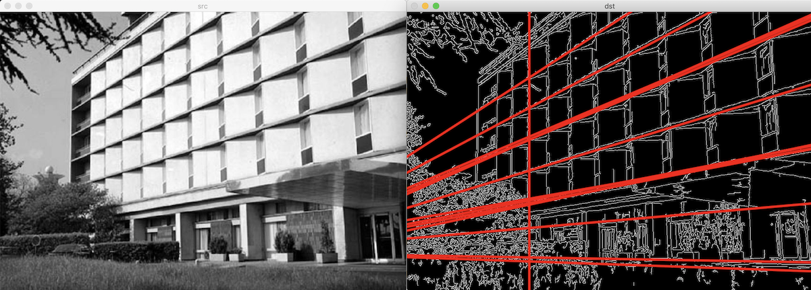
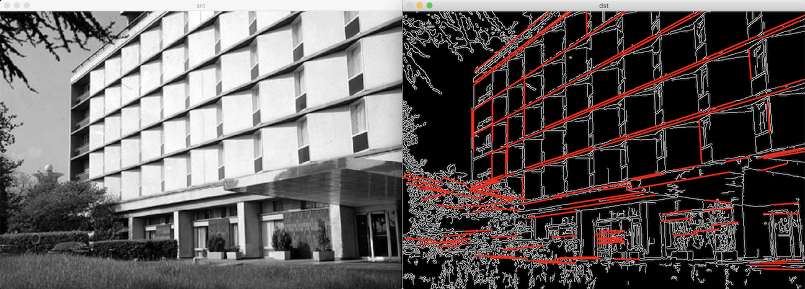
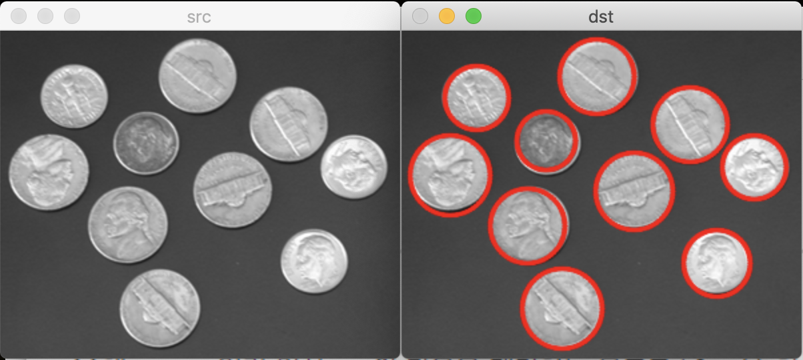

# 직선 검출과 원 검출

## 허프 변환 직선 검출

hough transform


xy 공간과 ab 공간에서 직선과 점이 뒤바뀐다.

따라서:

1. xy 공간에서 에지로 판별된 모든 점 -> ab 공간 직선 표현
2. ab 공간에서 직선이 교차되는 모든 좌표 탐색

축적 배열 accumulation array: 0으로 초기화된 2차원 배열에서 직선이 지니가는 위치의 배열 원소 값 1씩 증가시켜 생성

단점: y축과 평행한 수직선 표현 불가 -> 극좌표계 형식의 직선 방정식 사용

- ρ: 원점에서 직선까지 수직 거리
- θ: 0 ~ π. 원점에서 직선에 수직선을 내렸을 때 x축과 이루는 각도


- xy 공간의 점 -> ρθ 공간의 곡선
- ρθ 공간의 점 -> xy 공간의 직선

실수 ρ와 θ를 양자화(quantization)해야 한다.

### HoughLines

[HoughLines](https://docs.opencv.org/master/dd/d1a/group__imgproc__feature.html#ga46b4e588934f6c8dfd509cc6e0e4545a)

파라미터:

- image: 입력 영상. 보통 에지 영상 지정
- lines: 직선 정보를 저장할 출력 벡터
- rho: ρ 값의 해상도. 픽셀 단위
- theta: θ 값의 해상도. 라디안 단위
- threshold: 직선으로 판단할 임계값
- srn: ρ 해상도를 나누는 값. 멀티스케일 허프 변환 수행 때 사용
- stn: θ 해상도를 나누는 값
- min_theta: 검출할 직선의 최소 θ 값
- max_theta: 검출할 직선의 최대 θ 값

c++:

```cpp
void cv::HoughLines(InputArray image,
                    OutputArray lines,
                    double rho,
                    double theta,
                    int threshold,
                    double srn = 0,
                    double stn = 0,
                    double min_theta = 0,
                    double max_theta = CV_PI)
```

python:

```python
lines = cv.HoughLines(image, rho, theta, threshold[, lines[, srn[, stn[, min_theta[, max_theta]]]]])
```



### 확률적 허프 변환 probabilistic Hough transform

직선의 시작점과 끝점 좌표 반환.  
선분을 찾는 방법이다.

[HoughLinesP](https://docs.opencv.org/master/dd/d1a/group__imgproc__feature.html#ga8618180a5948286384e3b7ca02f6feeb)

파라미터:

- maxLineLength: 검출할 선분의 최소 길이
- maxLineGap: 직선으로 간주할 최대 에지 점 간격. 직선이 끊어져있을 때 하나의 직선으로 만든다.

c++:

```cpp
void cv::HoughLinesP(InputArray image,
OutputArray lines,
double rho,
double theta,
int threshold,
double minLineLength = 0,
double maxLineGap = 0)
```

python:

```python
lines = cv.HoughLinesP(image, rho, theta, threshold[, lines[, minLineLength[, maxLineGap]]])
```



## 허프 변환 원 검출


변수가 3개 이므로 3차원 공간이 필요하다.

대신 Hough gradient method를 사용한다.

1. 영상의 모든 원 중심 좌표 검색
   1. 모든 에지 픽셀의 그래디언트 계산
   2. 그래디언트 방향 직선 축적 배열 값 1씩 증가
   3. 모든 직선이 만나는 원 중심의 축적 배열 값이 가장 크다
2. 원 중심으로부터 적합한 반지름 계산

### HoughCircles

[HoughCircles](https://docs.opencv.org/master/dd/d1a/group__imgproc__feature.html#ga47849c3be0d0406ad3ca45db65a25d2d)

함수 내부에서 Sobel과 Canny 함수를 이용하여 그래디언트와 에지 영상을 계산한 후, 허프 그래디언트 방법으로 원을 검출한다.

파라미터:

- image: 그레이스케일 입력 영상
- circles: 출력 벡터
- method: `HOUGH_GRADIENT`
- dp: 입력 영상과 축적 배열의 크기 비율
- minDist: 인접한 원 중심의 최소 거리
- param1: Canny 에지 검출기의 높은 임계값
- param2: 축적 배열에서 원 검출을 위한 임계값
- minRadius: 검출할 원의 최소 반지름
- maxRadius: 검출할 원의 최대 반지름

c++:

```cpp
void cv::HoughCircles(InputArray image,
                      OutputArray circles,
                      int method,
                      double dp,
                      double minDist,
                      double param1 = 100,
                      double param2 = 100,
                      int minRadius = 0,
                      int maxRadius = 0)
```

python:

```python
circles = cv.HoughCircles(image, method, dp, minDist[, circles[, param1[, param2[, minRadius[, maxRadius]]]]])
```


