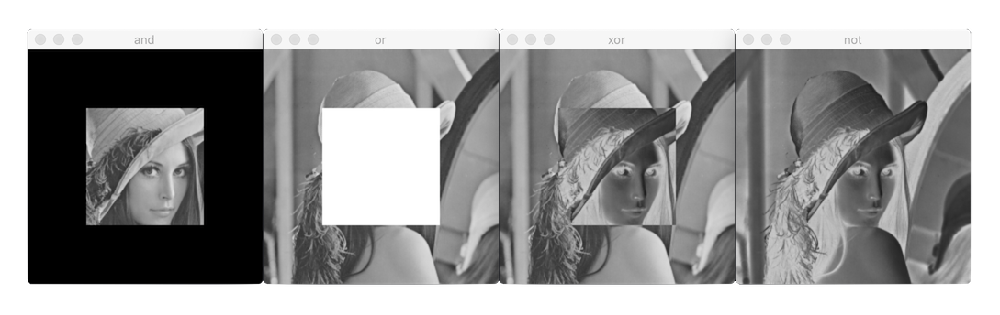

# 논리 연산

픽셀 값을 비트 단위로 논리 연산을 수행한다.

## 함수

### AND 논리곱

[bitwise_and](https://docs.opencv.org/master/d2/de8/group__core__array.html#ga60b4d04b251ba5eb1392c34425497e14)

- mask: 8비트 1채널 마스크 영상. mask 행렬 원소 값이 0이 아닌 위치에서 덧셈 연산 수행
- dtype: 출력 행렬 깊이. 깊이가 같은 경우 -1

c++:

```cpp
void cv::bitwise_and (InputArray src1, InputArray src2, OutputArray dst, InputArray mask = noArray())
```

python:

```py
dst = cv.bitwise_and(src1, src2[, dst[, mask]])
```

### OR 논리합

[bitwise_or](https://docs.opencv.org/master/d2/de8/group__core__array.html#gab85523db362a4e26ff0c703793a719b4)

c++:

```cpp
void cv::bitwise_or (InputArray src1, InputArray src2, OutputArray dst, InputArray mask = noArray())
```

python:

```py
dst = cv.bitwise_or(src1, src2[, dst[, mask]])
```

### XOR 배타적 논리합

[bitwise_xor](https://docs.opencv.org/master/d2/de8/group__core__array.html#ga84b2d8188ce506593dcc3f8cd00e8e2c)

c++:

```cpp
void cv::bitwise_xor (InputArray src1, InputArray src2, OutputArray dst, InputArray mask = noArray())
```

python:

```py
dst = cv.bitwise_xor(src1, src2[, dst[, mask]])
```

### NOT 부정

[bitwise_not](https://docs.opencv.org/master/d2/de8/group__core__array.html#ga0002cf8b418479f4cb49a75442baee2f)

c++:

```cpp
void cv::bitwise_not (InputArray src1, OutputArray dst, InputArray mask = noArray())
```

python:

```py
dst = cv.bitwise_not(src1[, dst[, mask]])
```

---

## 예

AND. OR. XOR. NOT.


