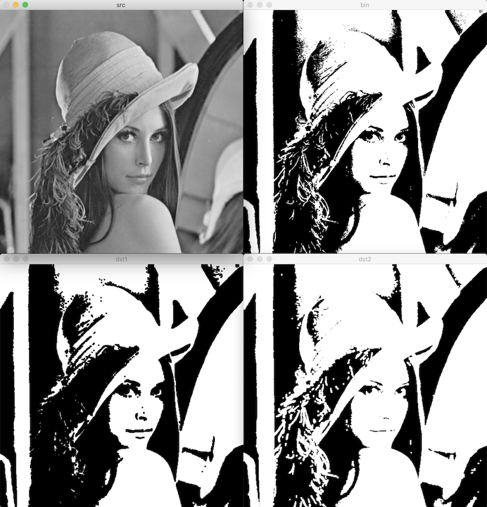
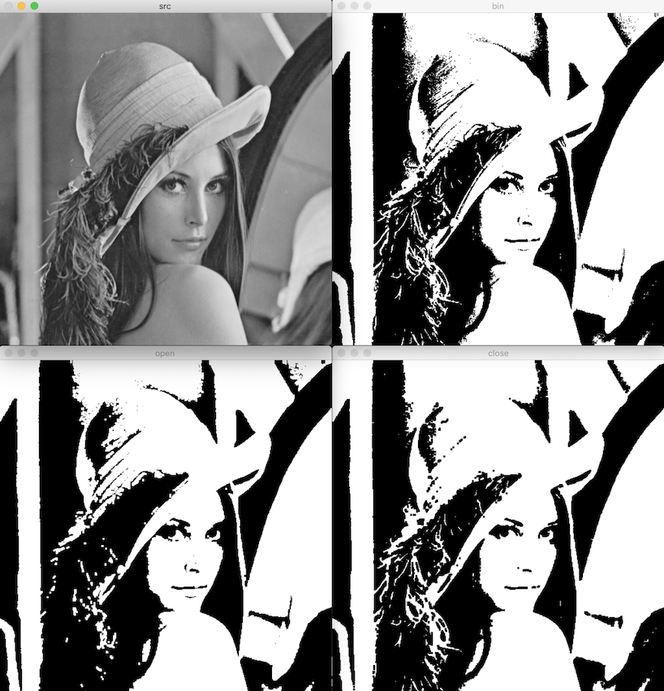

# 모폴로지 연산

- 영상 내부 객체의 형태와 구조를 분석하고 처리하는 기법
- 주로 이진화된 영상에서 객체 모양 변형하는 용도로 사용
- mathematical morphology

## 이진 영상의 침식과 팽창

구조 요소 structuring element 정의

연산: 구조 요소를 영상 전체에 대해 스캔하며 계산한다.

- 침식 erosion
  - 객체 영역의 외곽을 골고루 깎아 내는 연산
  - 객체 영역 축소. 배경 확대.
  - 구조 요소가 객체 영역 내부에 완전히 포함된 경우, 고정점 anchor point 위치 픽셀 = 255
- 팽창 dilation
  - 객체 외곽을 확대하는 연산
  - 객체 영역 확대. 배경 축소.
  - 구조 요소와 객체 영역이 한 픽셀이라도 만날 경우, 고정점 위치 픽셀 = 255

### 구조 요소 행렬

[getStructuringElement](https://docs.opencv.org/master/d4/d86/group__imgproc__filter.html#gac342a1bb6eabf6f55c803b09268e36dc)

파라미터:

- shape: 구조 요소 모양. [MorphShapes](https://docs.opencv.org/master/d4/d86/group__imgproc__filter.html#gac2db39b56866583a95a5680313c314ad)
  - MORPH_RECT: 사각형
  - MORPH_CROSS: 십자가
  - MORPH_ELLIPSE: 구조 요소 크기의 사각형에 내접하는 타원
- ksize: 구조 요소 크기. 가로세로 모두 홀수
- anchor: MORPH_CROSS 모양의 구조 요소에서 십자가 중심 좌표.
  - Point(-1, -1)을 지정하면 구조 요소 중앙을 십자가 중심 좌표로 사용
- 반환값: 구조 요소 행렬

c++:

```cpp
Mat cv::getStructuringElement(int shape, Size ksize, Point anchor = Point(-1,-1))
```

python:

```py
retval = cv.getStructuringElement(shape, ksize[, anchor])
```

### 침식 연산

[erode](https://docs.opencv.org/master/d4/d86/group__imgproc__filter.html#gaeb1e0c1033e3f6b891a25d0511362aeb)

파라미터:

- kernel: 구조 요소. `Mat()` 또는 `noArray()` = 3 x 3 사각형 구조 요소
- iterations: 반복 횟수
- borderType: 가장자리 픽셀 확장 방식
- borderValue: borderType이 BORDER_CONSTANT인 경우, 확장된 가장자리 픽셀을 채울 값.
  - 기본값의 함수는 모든 멤버 변수가 DBL_MAX로 채워진 Scalar 객체 반환

c++:

```cpp
void cv::erode(InputArray src, OutputArray dst, InputArray kernel,
               Point anchor = Point(-1,-1),
               int iterations = 1,
               int borderType = BORDER_CONSTANT,
               const Scalar & borderValue = morphologyDefaultBorderValue())
```

python:

```py
dst = cv.erode(src, kernel[, dst[, anchor[, iterations[, borderType[, borderValue]]]]])
```

### 팽창 연산

[dilate](https://docs.opencv.org/master/d4/d86/group__imgproc__filter.html#ga4ff0f3318642c4f469d0e11f242f3b6c)

c++:

```cpp
void cv::dilate(InputArray src, OutputArray dst, InputArray kernel,
                Point anchor = Point(-1,-1),
                int iterations = 1,
                int borderType = BORDER_CONSTANT,
                const Scalar & borderValue = morphologyDefaultBorderValue())
```

python:

```py
dst = cv.dilate(src, kernel[, dst[, anchor[, iterations[, borderType[, borderValue]]]]])
```



## 이진 영상의 열기와 닫기

객체의 영역의 크기는 바뀌지 않는다.

- 열기 opening: 침식 + 팽창
- 닫기 closing: 팽창 + 침식

### morphologyEx

[morphologyEx](https://docs.opencv.org/master/d4/d86/group__imgproc__filter.html#ga67493776e3ad1a3df63883829375201f)

파라미터:

- op: 모폴로지 연산 타입. [MorphTypes](https://docs.opencv.org/master/d4/d86/group__imgproc__filter.html#ga7be549266bad7b2e6a04db49827f9f32) 열거형 상수
  - MORPH_ERODE, MORPH_DILATE, MORPH_OPEN, MORPH_CLOSE
  - MORPH_GRADIENT: 팽창 - 침식 = 객체 외곽선 검출
  - MORPH_TOPHAT, MORPH_BLACKHAT, MORPH_HITMISS
- kernel: 구조 요소

c++:

```cpp
void cv::morphologyEx(InputArray src, OutputArray dst,
                      int op, InputArray kernel,
                      Point anchor = Point(-1,-1),
                      int iterations = 1,
                      int borderType = BORDER_CONSTANT,
                      const Scalar & borderValue = morphologyDefaultBorderValue())
```

python:

```py
dst = cv.morphologyEx(src, op, kernel[, dst[, anchor[, iterations[, borderType[, borderValue]]]]])
```



- 열기: 객체 외부의 작은 구멍들이 사라졌다.
- 닫기: 객체 내부의 작은 구멍들이 사라졌다.
