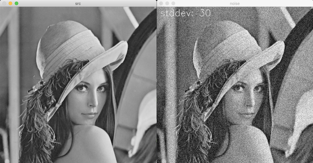
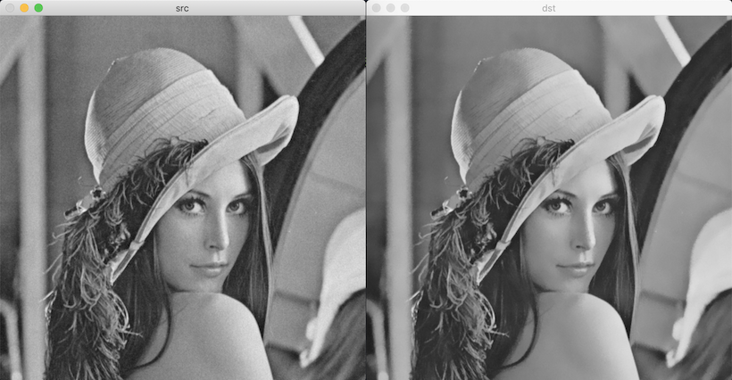
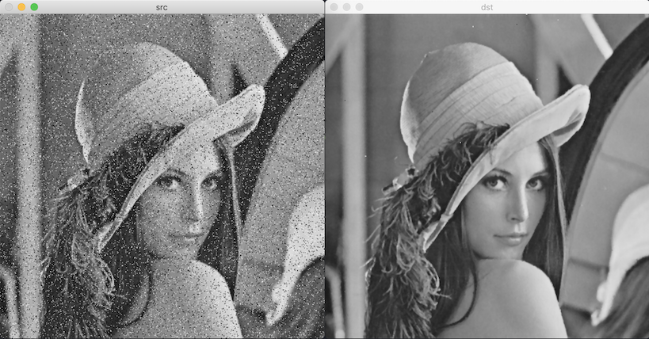

# 잡음 제거 필터링

표준 편차가 작은 가우시안 모델일 수록 픽셀 값 변화가 적다.

[randn](https://docs.opencv.org/master/d2/de8/group__core__array.html#gaeff1f61e972d133a04ce3a5f81cf6808)

파라미터:

- dst: 가우시안 난수 행렬
- mean: 가우시안 분포 평균
- stddev: 가우시안 분포 표준 편차

c++:

```cpp
void cv::randn(InputOutputArray dst, InputArray mean, InputArray stddev)
```

python:

```python
dst = cv.randn(dst, mean, stddev)
```



## 양방향 필터

에지 보전 잡음 제거 필터: edge-preserving noise removal filter


- f: 입력 영상
- g: 출력 영상
- p, q: 픽셀 좌표
- G<sub>σ</sub>: 표준 편차가 σ인 가우시안 분포 함수
- S: 필터 크기
- W<sub>p</sub>: 양방향 필터 마스크 합이 1이 되도록 하는 정규화 상수

두 개의 가우시안 함수의 구성된 필터이다.  
는 두 점 사이의 거리에 대한 가우시안 함수.  
는 두 점의 픽셀 값 차이에 의한 가우시안 함수. 두 점의 픽셀 밝기 값의 차이가 적은 평탄한 영역에서 큰 가중치를 갖게 만든다. 반면 에지를 사이에 두고 있는 픽셀은 상대적으로 0에 가까운 값이 된다. 따라서 에지가 보존된다.

[bilateralFilter](https://docs.opencv.org/master/d4/d86/group__imgproc__filter.html#ga9d7064d478c95d60003cf839430737ed)

파라미터:

- d: 필터링에 사용할 이웃 픽셀과의 거리(지름). 음수: sigmaSpace로부터 자동 계산됨.
- sigmaColor: 색 공간에서의 가우시안 필터 표준 편차. 값이 클수록 더 많은 주변 픽셀 고려하여 블러링.
- sigmaSpace: 좌표 공간에서의 가우시안 필터 표준 편차. 주변 픽셀과의 밝기 차이에 관한 표준 편차. 값이 작으면 픽셀 값 차이가 큰 주변 픽셀과는 블러링 적용 되지 않음. 어느 정도 밝기 차를 갖는 에지를 보존할 것인지를 조정한다.

c++:

```cpp
void cv::bilateralFilter(InputArray src, OutputArray dst, 
                         int d, double sigmaColor, double sigmaSpace,
                         int borderType = BORDER_DEFAULT)
```

python:

```python
dst = cv.bilateralFilter(src, d, sigmaColor, sigmaSpace[, dst[, borderType]])
```



## median filter

자신과 주변 픽셀 값 중 중간값으로 필터링한다.

salt & pepper noise를 추가해도 미디언 필터를 적용하면 원본 영상에 존재하는 픽셀 값이 중간값으로 선택된다.

[meidanBlur](https://docs.opencv.org/master/d4/d86/group__imgproc__filter.html#ga564869aa33e58769b4469101aac458f9)

c++:

```cpp
void cv::medianBlur(InputArray src, OutputArray dst, int ksize);
```

python:

```python
dst = cv.medianBlur(src, ksize[, dist])
```


