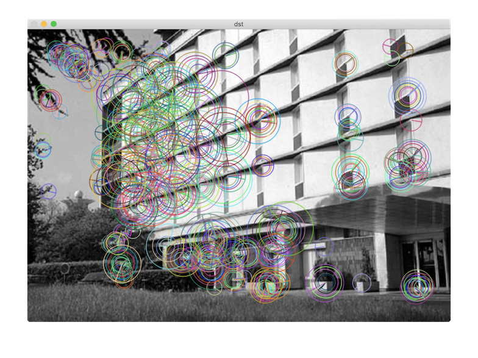

# 크기 불변 특징점 검출

크기 불변 특징 변환: Scale Invariant Feature Transform

- Scale space: 여러 표준 편차로 가우시안 블러링 적용한 영상 집합
- 서브 샘플링으로 여러 Octave(피라미드 단계)를 구성
- 차영상 Difference of Gaussian: 인접한 가우시안 블러링 영상의 차

SIFT 알고리즘: 
- DoG 영상 집합에서 인접한 DoG 영상을 고려한 지역 극값 위치를 특징점으로 사용
- 에지 성분이 강하거나 명암비가 낮은 지점은 특징점에서 제외
- 그래디언트 방향 히스토그램을 기술자로 사용
  - 특징점 기술자: 특징점 주변 영상의 특성을 여러 개의 실수 값으로 표현한 것
    - feature descriptor
    - feature vector
    - 이진 기술자: 주변 정보를 이진수로 표현
- 특징점의 주된 방향 성분으로 회전한 부분 영상으로 128개 빈 그래디언트 방향 히스토그램
- 그외: SURF, KAZE, ORB, BRISK, AKAZE, FREAK

Hamming distance: 이진수로 표현된 두 기술자에서 서로 값이 다른 비트의 개수 세는 방식
  - 비트 단위 배타적 논리합 연산 후 비트 값이 1인 개수 세는 방식

특징점: [KeyPoint](https://docs.opencv.org/master/d2/d29/classcv_1_1KeyPoint.html)



```bash
keypoints.size(): 500 # 500개 특징점
desc.size(): [32 x 500] # 기술자 행렬 500행, 32열
```
