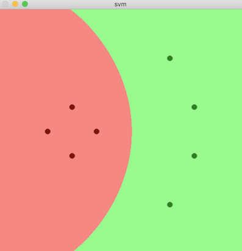
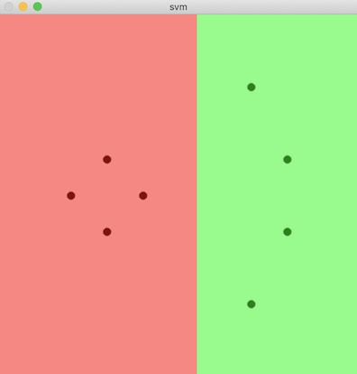
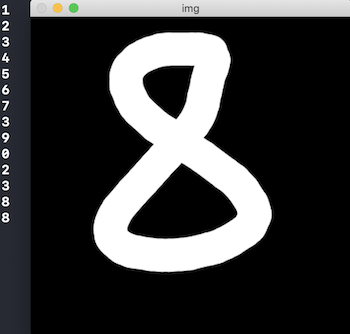

# 서포트 벡터 머신

[cv::ml::SVM](https://docs.opencv.org/master/d1/d2d/classcv_1_1ml_1_1SVM.html)

## Support Vector Machine

두 개의 클래스로 구성된 데이터를 가장 여유 있게 분리하는 초평면을 찾는 머신 러닝 알고리즘

- 초평면: 두 클래스의 데이터를 분리하는 N차원 공간상의 평면
- 커널 트릭: 적절한 커널 함수를 이용하여 입력 데이터 특징 공간 차원을 늘리는 방식
  - 데이터를 고차원 특징 공간으로 이동하여 선형으로 분리 가능한 형태로 만듦

### 커널 함수 종류

[KernelTypes](https://docs.opencv.org/master/d1/d2d/classcv_1_1ml_1_1SVM.html#aad7f1aaccced3c33bb256640910a0e56)

- 선형 linear
- 다항식 polynomial
- 방자 기저 함수 radial basis function: 기본값
- 시그모이드 sigmoid
- 지수 카이 제곱 exponential chi-square
- 히스토램 교차 histogram intersection

### create

객체 생성 함수

[create](https://docs.opencv.org/master/d1/d2d/classcv_1_1ml_1_1SVM.html#a2fe8b5bf897c34b8e911397b42e2cb44)

c++:

```cpp
static Ptr<SVM> cv::ml::SVM::create()
```

python:

```python
retval = cv.ml.SVM_create()
```

### setType

[setType](https://docs.opencv.org/master/d1/d2d/classcv_1_1ml_1_1SVM.html#a0dd2c2aea178a3c9136eda6443d5bb7b)

파라미터:

- val: SVM 타입. 
  - [SVM::Types](https://docs.opencv.org/master/d1/d2d/classcv_1_1ml_1_1SVM.html#ab4b93a4c42bbe213ffd9fb3832c6c44f)
    - C_SVC: 기본값. N-클래스 분류 문제에 사용.
      - C 값이 작을 때: 잘못 분류되어도 최대 마진 선택
      - C 값이 클 때: 마진이 작더라도 잘못 분류되는 데이터가 적음
      - 잡음이나 이상치가 많은 경우 C를 크게 설정한다.
    - NU_SVC, ONE_CLASS, EPS_SVR, NU_SVR


### setKernel

커널 함수 지정

[setKernel](https://docs.opencv.org/master/d1/d2d/classcv_1_1ml_1_1SVM.html#ad6f4f45983d06817b9782978ca0f6f6f)

파라미터:

- kernelType: 커널 함수 종류
  - [kernelTypes](https://docs.opencv.org/master/d1/d2d/classcv_1_1ml_1_1SVM.html#aad7f1aaccced3c33bb256640910a0e56)

### findNearest

성능이 좋은 파라미터로 자동 학습하는 함수

[trainAuto](https://docs.opencv.org/master/d1/d2d/classcv_1_1ml_1_1SVM.html#a533d3d3f950fed3f75be0d8692eeff58)

파라미터:

- samples: 훈련 데이터 행렬
- layout: 훈련 데이터 배치 방법. `ROWS_SAMPLE`, `COL_SAMPLE`
- responses: 각 훈련 데이터에 대응되는 응답 벡터
- kFold: 교차 검증을 위한 부분 집합 개수
- Cgird, gammaGrid, pGrid, nuGrid, coeffGrid, degreeGrid: 탐색 범위
- balanced: true이고 두 클래스 분류 문제인 경우, 좀 더 균형잡힌 교차 검증 부분 집합 생성
- 반환값: 학습 완료 true

c++:

```cpp
virtual bool cv::ml::SVM::trainAuto(const Ptr< TrainData > & data,
                                    int kFold = 10,
                                    ParamGrid Cgrid = getDefaultGrid(C),
                                    ParamGrid gammaGrid = getDefaultGrid(GAMMA),
                                    ParamGrid pGrid = getDefaultGrid(P),
                                    ParamGrid nuGrid = getDefaultGrid(NU),
                                    ParamGrid coeffGrid = getDefaultGrid(COEF),
                                    ParamGrid degreeGrid = getDefaultGrid(DEGREE),
                                    bool balanced = false)
virtual bool cv::ml::SVM::trainAuto(InputArray samples, 
                                    int layout, 
                                    InputArray responses, 
                                    int kFold = 10,
                                    Ptr< ParamGrid > Cgrid = SVM::getDefaultGridPtr(SVM::C),
                                    Ptr< ParamGrid > gammaGrid = SVM::getDefaultGridPtr(SVM::GAMMA),
                                    Ptr< ParamGrid > pGrid = SVM::getDefaultGridPtr(SVM::P),
                                    Ptr< ParamGrid > nuGrid = SVM::getDefaultGridPtr(SVM::NU),
                                    Ptr< ParamGrid > coeffGrid = SVM::getDefaultGridPtr(SVM::COEF),
                                    Ptr< ParamGrid > degreeGrid = SVM::getDefaultGridPtr(SVM::DEGREE),
                                    bool balanced = false)
```

python:

```python
retval = cv.ml_SVM.trainAuto(samples, layout, responses[, kFold[, Cgrid[, gammaGrid[, pGrid[, nuGrid[, coeffGrid[, degreeGrid[, balanced]]]]]]]])
```




## HOG & SVM 필기체 숫자 인식

1. HOG 특징 벡터 추출
   - 숫자 크기: 20x20
   - 셀 크기: 5x5
   - 블록 크기: 10x10
   - 셀 히스토그램: 9개 빈
   - 블록 히스토그램: 36개 빈
   - 블록 개수: 3x3
   - 숫자 하나 특징 벡터 차원 크기: 36x9 = 324
   - 행렬 크기: 5000x324
2. SVM 모델 생성
3. 예측

HOGDescriptor 객체 생성: [HOGDescriptor](https://docs.opencv.org/master/d5/d33/structcv_1_1HOGDescriptor.html#a5c8e8ce0578512fe80493ed3ed88ca83)

검출 윈도우 크기, 블록 크기, 블록 이동 크기, 셀 크기, 히스토그램 빈 개수

```c++
HOGDescriptor hog(Size(20, 20), Size(10, 10), Size(5, 5), Size(5, 5), 9);
```

HOG 기술자 계산: [compute](https://docs.opencv.org/master/d5/d33/structcv_1_1HOGDescriptor.html#a38cd712cd5a6d9ed0344731fcd121e8b)


