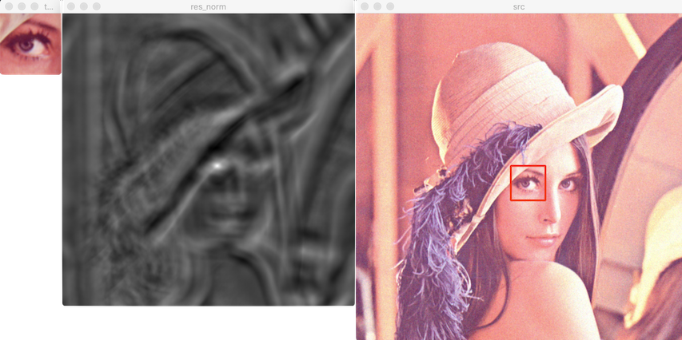

# 템플릿 매칭

템플릿: 찾고자 하는 대상이 되는 작은 크기의 영상

- 유사도: similarity
- 비유사도: dissimilarity

## 함수

### matchTemplate

[matchTemplate](https://docs.opencv.org/master/df/dfb/group__imgproc__object.html#ga586ebfb0a7fb604b35a23d85391329be)

- 결과 영상 크기: 
- 비교 방법: TM_CCOEFF_NORMED. 결과 -1 ~ 1 실수. 1에 가까울 수록 유사한 영상

#### 예



```bash
maxv: 0.96161
```
